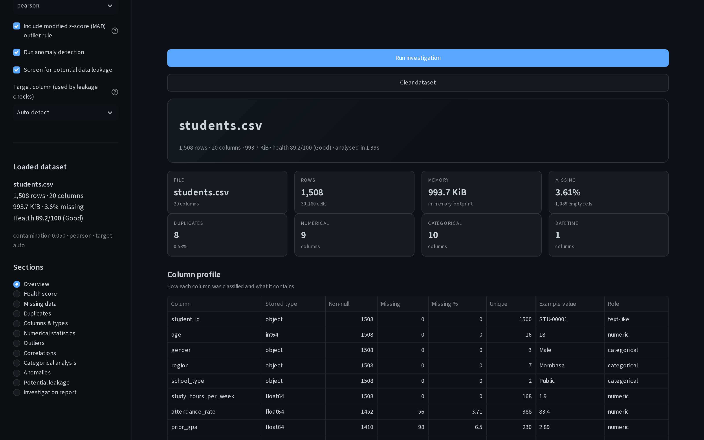
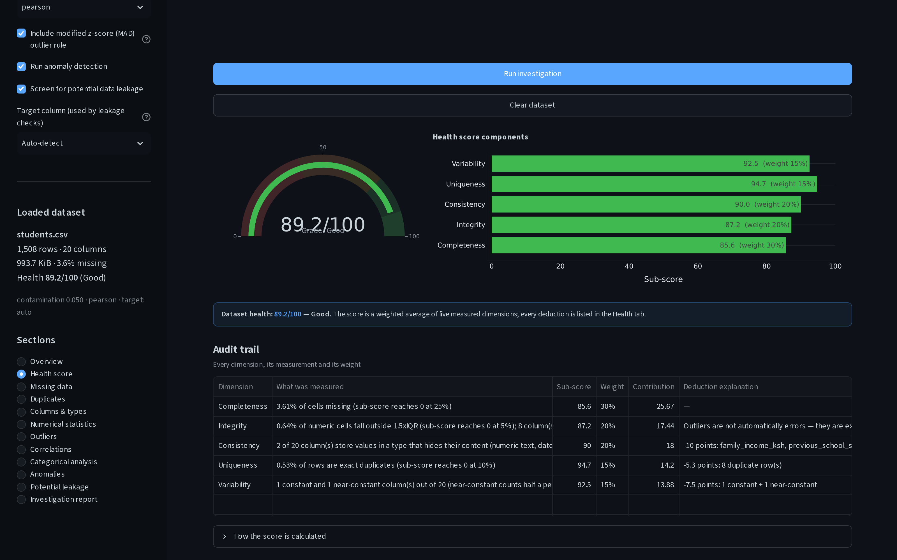
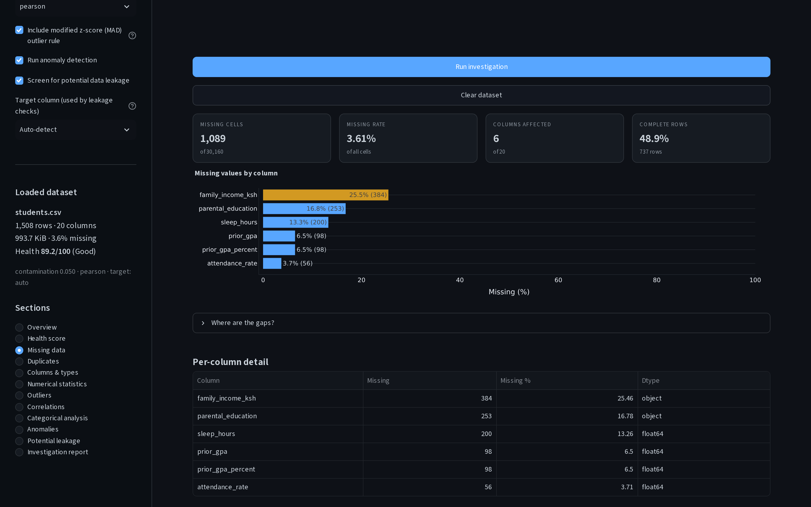
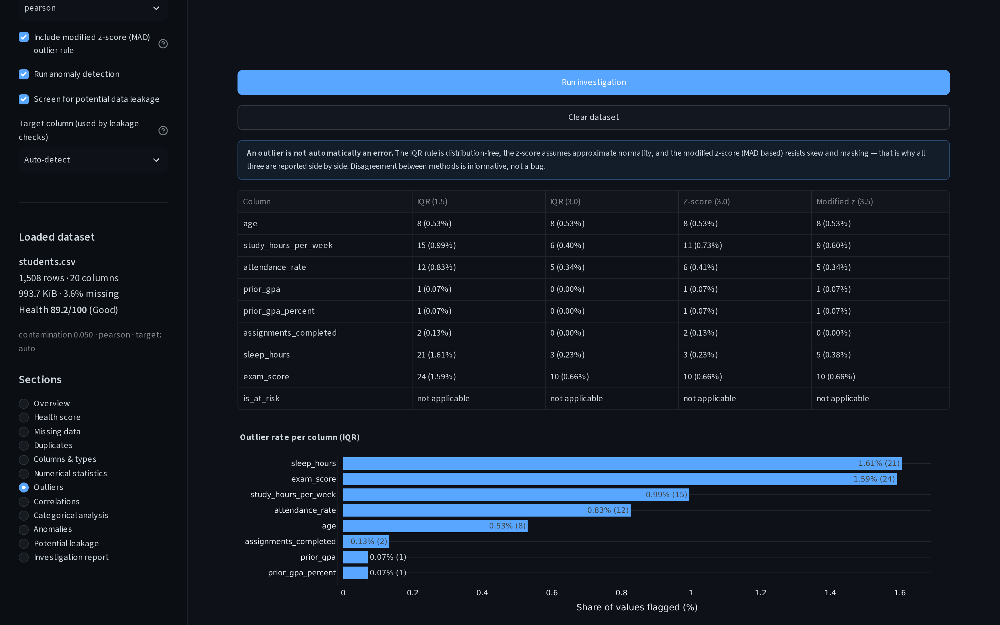
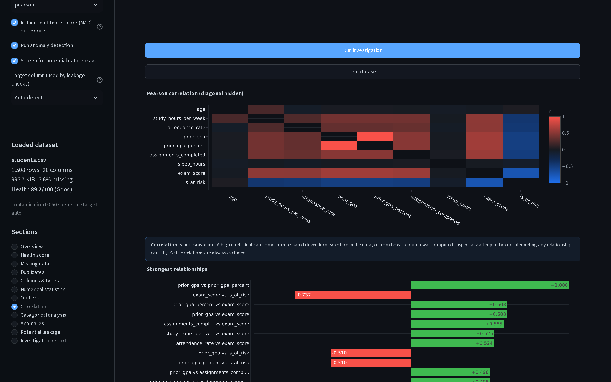
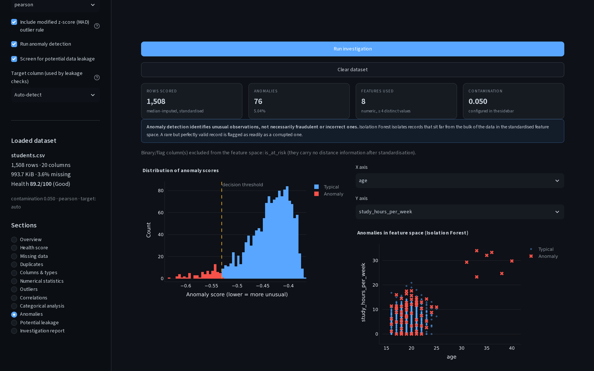
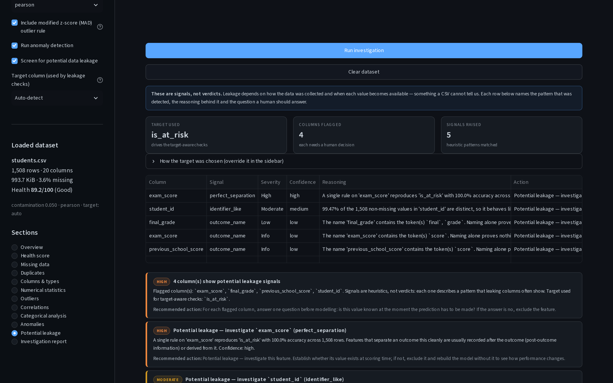
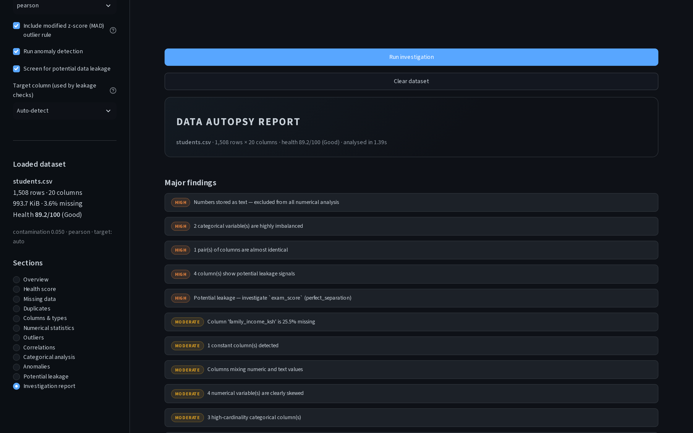

# DATA AUTOPSY

**A statistical and data-quality investigation tool for CSV datasets.**
Upload a file, and DATA AUTOPSY answers one question: *what is wrong, unusual, interesting or statistically important about this dataset?*

It is a rule-based analysis engine — **no AI model produces any number, score or finding**. Every result is computed from the file you uploaded, is reproducible, and comes with the reasoning and the recommended action attached.

[](#testing)
[](https://www.python.org/)
[](LICENSE)
[](https://streamlit.io/)

---

## Table of contents

- [Why this exists](#why-this-exists)
- [Features](#features)
- [Screenshots](#screenshots)
- [Architecture](#architecture)
- [Installation](#installation)
- [Usage](#usage)
- [Supported file format](#supported-file-format)
- [Methodology](#methodology)
- [The health score](#the-health-score)
- [Anomaly detection methodology](#anomaly-detection-methodology)
- [Potential data leakage screening](#potential-data-leakage-screening)
- [Example output](#example-output)
- [Sample dataset](#sample-dataset)
- [Testing](#testing)
- [Limitations](#limitations)
- [Future improvements](#future-improvements)
- [Contributing](#contributing)
- [License](#license)

---

## Why this exists

Most dataset problems are boring and invisible: missing values that are not missing at random, a column that never changes, numbers stored as text, a feature that quietly encodes the answer you are trying to predict. These problems do not throw exceptions — they just make every downstream result wrong.

DATA AUTOPSY runs the full checklist automatically, in the open. You do not get a black-box "data quality: 73%" — you get the measurement, the threshold it was compared against, the effect it has, and what to do about it.

---

## Features

| # | Investigation | What you get |
|---|---------------|--------------|
| 1 | **Dataset structure** | filename, rows, columns, memory footprint, cells, column roles (numeric / categorical / datetime / boolean / text-like) |
| 2 | **Health score** | weighted, fully auditable 0–100 score with a dimension-by-dimension deduction trail |
| 3 | **Missing data** | counts, rates, affected columns, a missingness map, and "investigate the mechanism before imputing" guidance |
| 4 | **Duplicate records** | exact duplicate rows, duplicate rate, duplicate groups and example records |
| 5 | **Data types** | numbers stored as text, dates stored as text, mixed-format columns — the silent killers of numerical analysis |
| 6 | **Constant / low-variance columns** | constant and near-constant features (default: one value ≥ 99% of rows) and why they cannot help a model |
| 7 | **Numerical distributions** | count, mean, median, std, min, Q1, Q3, max, IQR, skewness, kurtosis, zero share, coefficient of variation |
| 8 | **Outliers** | three independent rules (IQR, z-score, modified z-score/MAD), per-column rates, examples, and disagreement analysis |
| 9 | **Correlations** | labelled heatmap, strongest positive *and* negative pairs, p-values, multicollinearity flags — self-correlations always excluded |
| 10 | **Categorical analysis** | cardinality, dominance ("98.7% of observations belong to one category"), rare levels, entropy, high-cardinality warnings |
| 11 | **Categorical association** | bias-corrected Cramér's V with chi-square tests between categorical variables |
| 12 | **Statistical anomalies** | Isolation Forest with configurable contamination, anomaly scores, percentiles, feature attribution and examples |
| 13 | **Potential data leakage** | six heuristic signals with reasoning, confidence and the exact question a human must answer — never a verdict |
| 14 | **Automated report** | a full investigation report as **Markdown** and **self-contained HTML**, downloadable and dataset-specific |
| 15 | **Statistical anomalies in text** | impossible/placeholder values (e.g. `-1`, `9999`, `-99`) surfaced as *suspected* sentinel codes |
| 16 | **Opt-in cleaning** | preview numeric-text conversion, missing-value handling and duplicate removal, then download a separate cleaned CSV |

Plus: graceful handling of numerically empty datasets, all-categorical datasets, single-column files, single-row files, files with 10⁴ distinct encodings of the same header, and datasets where every value is missing.

---

## Screenshots

All screenshots below are real captures of the running application (`scripts/capture_screenshots.py`) on the bundled synthetic dataset.

### Overview — structure, column roles and memory



### Health score — the audit trail, not a black box



### Missing data



### Outliers — three methods, compared side by side



### Correlations



### Anomalies — Isolation Forest with feature attribution



### Potential leakage — signals with reasoning, not verdicts



### Automated investigation report — downloadable as Markdown and HTML



---

## Architecture

The analysis engine has **no Streamlit dependency**, so every analytical step can be unit-tested, reused in notebooks, or driven from CI. The dashboard is a thin presentation layer on top.

```
data-science-lab/
├── app.py                        # Streamlit entry point (UI wiring only)
├── requirements.txt              # runtime dependencies
├── requirements-dev.txt          # test + screenshot tooling
├── pytest.ini                    # test configuration
├── README.md
├── LICENSE
├── .gitignore
├── .streamlit/config.toml        # dark theme + upload limits
│
├── src/
│   ├── __init__.py
│   ├── config.py                 # every threshold, weight and label — one place
│   ├── schema.py                 # typed result objects (dataclasses) shared by all modules
│   ├── utils.py                  # formatting, safe arithmetic, name tokenisation
│   ├── data_loader.py            # robust CSV loading, column classification, dtype-drift detection
│   ├── quality.py                # missingness, duplicates, low variance, dtype issues
│   ├── statistics.py             # descriptive statistics for numeric columns
│   ├── categorical.py            # cardinality, dominance, entropy, frequency tables
│   ├── outliers.py               # IQR, z-score, modified z-score (MAD), sentinel detection
│   ├── correlations.py           # Pearson/Spearman/Kendall + Cramér's V
│   ├── anomalies.py              # Isolation Forest screening
│   ├── leakage.py                # heuristic leakage signals (never verdicts)
│   ├── health.py                 # transparent weighted health score
│   ├── cleaning.py               # opt-in transformations with an audit summary
│   ├── investigation.py          # the orchestrator: runs everything, returns one report object
│   ├── reporting.py              # Markdown + HTML report writers
│   ├── charts.py                 # Plotly figure builders (no Streamlit import)
│   ├── ui_theme.py               # dashboard CSS and HTML component builders
│   └── ui_sections.py            # Streamlit renderers, one function per section
│
├── tests/
│   ├── test_quality.py           # loading, missingness, duplicates, variance, dtypes
│   ├── test_statistics.py        # descriptive statistics, categorical analysis, health score
│   ├── test_outliers.py          # IQR / z-score / MAD rules and their edge cases
│   ├── test_correlations.py      # correlation, Cramér's V, Isolation Forest
│   ├── test_leakage.py           # leakage heuristics and their honesty properties
│   ├── test_investigation.py     # end-to-end pipeline, edge-case datasets, report writers
│   └── test_app.py               # the real Streamlit app via Streamlit's AppTest harness
│
├── scripts/
│   ├── demo_investigation.py     # CLI runner: investigate a CSV and write reports
│   └── capture_screenshots.py    # headless-browser screenshots of the dashboard
│
├── sample_data/
│   ├── make_sample_data.py       # generator for the synthetic demo dataset
│   └── students.csv              # 1,508 × 20 synthetic rows with deliberate defects
│
└── screenshots/                  # real captures of the running dashboard
```

### Data flow

```
CSV bytes ─▶ data_loader.load_dataframe ─▶ DataFrame + loader warnings
                                             │
                        investigation.run_investigation(options, progress)
                                             │
   ┌──────────┬──────────┬───────────┬───────┴────┬──────────┬───────────┬──────────┐
 quality    statistics  categorical  outliers   correlations anomalies  leakage   health
   └──────────┴──────────┴───────────┴────────────┴──────────┴───────────┴──────────┘
                                             │
                                    InvestigationReport
                                    ├─▶ ui_sections   (Streamlit dashboard)
                                    └─▶ reporting     (Markdown / HTML download)
```

---

## Installation

Requires **Python 3.10+**.

```bash
git clone https://github.com/amsx1/data-science-lab.git
cd data-science-lab

python -m venv .venv
source .venv/bin/activate          # Windows: .venv\Scripts\activate

pip install -r requirements.txt
```

For development (tests + screenshot tooling):

```bash
pip install -r requirements-dev.txt
```

---

## Usage

### 1. The dashboard

```bash
streamlit run app.py
```

Streamlit prints a local URL (default <http://localhost:8501>). Then:

1. Upload a CSV/TSV/TXT file in the sidebar — or press **Load synthetic demo dataset** to explore without any data of your own.
2. Adjust the investigation settings if you want to (anomaly contamination, correlation method, leakage target column).
3. Press **Run investigation**.
4. Walk through the investigation sections: Overview → Health score → Missing data → Duplicates → Columns & types → Numerical statistics → Outliers → Correlations → Categorical analysis → Anomalies → Potential leakage → Investigation report.
5. Download the report as Markdown or HTML from the last section.
6. Open **Clean data** to preview optional type conversion, duplicate removal, and missing-value handling, then download a separate cleaned CSV. The investigation and uploaded source remain unchanged.

### 2. The command line (no browser)

```bash
python scripts/demo_investigation.py sample_data/students.csv --out reports/
```

```
Loaded students.csv: 1,508 rows x 20 columns (993.7 KiB, encoding utf-8, delimiter ',')
  [  5.0%] Profiling dataset structure
  ...
  [100.0%] Finalising report

========================================================================
DATA AUTOPSY REPORT
========================================================================
Dataset : students.csv
Shape   : 1,508 rows x 20 columns
Health  : 89.2/100 (Good)

Major findings
  - [High] Numbers stored as text — excluded from all numerical analysis
  - [High] 2 categorical variable(s) are highly imbalanced
  - [High] 1 pair(s) of columns are almost identical
  ...

Completed in 1.91s.
```

Options: `--out DIR`, `--contamination 0.03`, `--correlation spearman`, `--target is_at_risk`, `--quiet`.

### 3. As a Python library

```python
from src.data_loader import load_dataframe
from src.investigation import InvestigationOptions, run_investigation
from src.reporting import build_markdown_report

loaded = load_dataframe("sample_data/students.csv")
report = run_investigation(
    loaded.frame,
    filename=loaded.filename,
    options=InvestigationOptions(contamination=0.03, correlation_method="spearman"),
)

print(report.health.score, report.health.grade)      # 89.2 Good
print(report.missing.missing_rate)                   # 0.0361...
print([f.title for f in report.critical_findings()])

open("autopsy.md", "w").write(build_markdown_report(report))
```

---

## Supported file format

Delimited text files: `.csv`, `.tsv`, `.txt` — comma, semicolon, tab or pipe separated (auto-detected).

The loader is deliberately forgiving and **tells you what it had to repair**:

| Situation | Behaviour |
|-----------|-----------|
| Unknown encoding | tries UTF-8 → UTF-8-BOM → CP1252 → Latin-1, then replaces undecodable bytes and warns |
| Wrong delimiter guess | sniffs with `csv.Sniffer`, falls back to the most frequent candidate, warns |
| Duplicate headers (`age, age`) | recovered as `age`, `age_duplicate_1` |
| Headers with stray whitespace | trimmed, normalised, warned |
| Pandas index artefact (`Unnamed: 0`) | dropped with a warning |
| Rows with too many/few fields | skipped with a warning (never silently truncated) |
| Completely empty rows / columns | removed and reported |
| Binary files (PNG, ZIP, PDF, Excel) | rejected with a clear message instead of producing garbage |
| Files > 200,000 rows | analysed on the first 200,000 rows; the truncation is reported |

**Not supported directly:** `.xlsx`, `.parquet`, `.json`, databases, URLs. Export to CSV first (the loader says so instead of guessing).

---

## Methodology

Every threshold lives in [`src/config.py`](src/config.py) and is shown in the app; nothing is dataset-specific or hard-coded to the demo data.

| Analysis | Method | Default thresholds |
|----------|--------|--------------------|
| Missing data | per-cell null count on the raw frame; **no imputation is applied to your data** | low 5%, moderate 20%, high 50%, critical 80% |
| Duplicates | exact row equality across all columns (`pandas.duplicated`) | low 0.1%, moderate 1%, high 5% |
| Constant columns | single distinct value | — |
| Near-constant columns | one value covers ≥ 99% of non-missing rows | 99% |
| Outliers — IQR | Tukey fences: below `Q1 − k·IQR`, above `Q3 + k·IQR` | k = 1.5, extreme k = 3.0 |
| Outliers — z-score | `|z| > k` with `z = (x − μ)/σ` | k = 3.0, requires ≥ 8 values |
| Outliers — modified z-score | `|0.6745·(x − median)/MAD| > k` (Iglewicz & Hoaglin) | k = 3.5 |
| Correlation | pairwise-complete Pearson (also Spearman/Kendall), p-values for the strongest pairs | strong 0.70, moderate 0.50, near-duplicate 0.995 |
| Multicollinearity | `|r| ≥ 0.80` flagged as potentially redundant features | 0.80 |
| Categorical association | bias-corrected Cramér's V + chi-square (Bergsma correction) | strong 0.50, very strong 0.70 |
| Dominant category | single level above a share of rows | 90%, severe 98% |
| Rare levels | level below a share of rows | 1% |
| Numeric stored as text | ≥ 90% of values parse as numbers after removing separators/currency symbols | 90% |
| Datetime stored as text | ≥ 90% of sampled values parse as dates (regex-gated to avoid misreading integers) | 90% |
| Sentinel values | extreme values repeatedly equal to `-1, -9, -99, -999, 999, 9999…` | suspected, never asserted |

### Statistical notes

- **Skewness / kurtosis** use pandas' unbiased estimators; kurtosis is reported as *excess* kurtosis (a normal distribution scores 0).
- **Standard deviations** use the sample estimator (`ddof=1`); **z-scores** use the population standard deviation (`ddof=0`), matching the textbook definition of the rule.
- **Correlations use pairwise complete observations**, so a column with missing values still contributes; the pair count `n` is shown next to every coefficient so a correlation built on 12 rows cannot masquerade as a strong result.
- **Self-correlations are never reported.** The heatmap blanks the diagonal and the pair list excludes `a ↔ a` by construction.
- **Correlation is not causation**, and the tool says so in the UI, in the report and in every related recommendation. A high coefficient can come from a shared driver, from selection in the data, or from the way a column was computed.
- **Special cases handled explicitly:** a zero IQR (more than half the values identical), a zero MAD (same), the masking effect that hides outliers from the plain z-score, and columns with fewer than four distinct values, which are excluded from outlier tests because the minority class would otherwise be reported as an "outlier".

---

## The health score

The score is a **weighted average of five measured dimensions**. There is no machine learning, no randomness and no hidden judgement; the same file always produces the same number, and every deducted point is listed in the app and in the report.

```
score = Σ (sub_score_i × weight_i)
```

| Dimension | Weight | Measurement | Sub-score reaches 0 at |
|-----------|--------|-------------|------------------------|
| Completeness | 30% | share of missing cells (−5 points per column > 50% missing) | 25% missing cells |
| Integrity | 20% | share of numeric cells outside the 1.5×IQR fences | 5% of numeric cells |
| Consistency | 20% | share of columns whose stored type hides their content | 100% of columns |
| Uniqueness | 15% | share of exact duplicate rows | 10% of rows |
| Variability | 15% | share of constant + near-constant columns (near-constant counts half) | 100% of columns |

Sub-scores are linear and saturated, so the score is **monotone**: cleaning a dataset can never lower it.

**Leakage signals are deliberately excluded** from the score. They are name- and pattern-based heuristics that cannot be verified automatically, and folding them into a number would present a guess as a measurement. They are reported separately as risks.

**A high score means the dataset is clean, not that it is useful.** A perfectly hygienic table can still be biased, unrepresentative, or irrelevant to the question you are asking.

| Score | Grade |
|-------|-------|
| 90–100 | Excellent |
| 75–89.9 | Good |
| 60–74.9 | Fair |
| 40–59.9 | Poor |
| 0–39.9 | Critical |

---

## Anomaly detection methodology

**Algorithm:** scikit-learn `IsolationForest` (Liu, Ting & Zhou, 2008). It isolates observations by repeatedly splitting the feature space at random; points that become isolated after few splits are unusual. It is unsupervised, distribution-free, handles mixed scales after preprocessing and scales linearly with rows.

**Pipeline, in order:**

1. **Feature selection** — numeric columns only; columns with fewer than 4 distinct values (binary flags, constants) are excluded, because after standardisation they carry no distance information. Excluded columns are named in the interface.
2. **Imputation** — remaining gaps are filled with each column's **median**, so no row is silently dropped from the screen.
3. **Scaling** — `StandardScaler` (zero mean, unit variance), so no column dominates by virtue of its units.
4. **Fitting** — `n_estimators=200`, `random_state=42` (fixed seed → reproducible results), `contamination` set by you.
5. **Scoring** — every row receives an `anomaly_score` (lower = more unusual), a decision value and a percentile rank against the rest of the dataset.
6. **Attribution** — for each feature, the mean absolute **robust z-score** (median/MAD) over the flagged rows is computed, showing *which* dimensions make those records unusual.
7. **Reporting** — count, rate, examples (most anomalous first) and the reason for the setting.

**What `contamination` really does:** it forces the algorithm to label roughly that fraction of rows as anomalies. It is an assumption about your data, not a measurement. The tool warns you when it is set above 0.25 and suggests comparing runs at 0.01–0.10.

**What an anomaly is *not*:** it is not proof of fraud, error or invalid data. A rare but perfectly valid record is flagged exactly because it is rare. Inspect flagged records with domain knowledge before removing anything — and remember that if the rare cases matter for your task, deleting them is the worst possible response.

**Verified behaviour:** the test suite plants multivariate outliers (e.g. `[12, 12, 12]` in a standard-normal cloud) and asserts that Isolation Forest recovers them, that results are deterministic for a fixed seed, that missing values are imputed rather than dropped, and that unavailable analyses degrade to an explanatory message instead of an exception.

---

## Potential data leakage screening

**The tool never claims leakage exists.** Leakage is a property of how a model will be trained and deployed — it cannot be determined from a CSV alone. What DATA AUTOPSY produces is *signals*: reproducible observations that a column behaves the way leaking columns usually behave, with the reasoning and the question a human must answer.

| Signal | Fires when | Confidence | Typical meaning |
|--------|-----------|------------|-----------------|
| `identifier_like` | non-numeric column ≥ 95% unique, or an ID-style **whole-word** name with high cardinality | medium / low | a record key that cannot generalise to unseen rows |
| `duplicate_column` | two columns hold identical values for every row where both are present | high | the same measurement stored twice |
| `target_copy` | a column duplicates the identified target | high | the outcome is available as a feature |
| `target_correlation` | \|Spearman r\| ≥ 0.98 between a feature and a numeric target | medium | the feature is derived from the outcome |
| `perfect_separation` | a single threshold rule on one feature reproduces a binary target with ~100% accuracy (searched in both directions) | high | post-outcome information |
| `outcome_name` | name tokens such as `final`, `after`, `resolved`, `status`, `grade` (whole-word matched) | low / info | timing must be verified, nothing proven |

**Honesty properties that are unit-tested:**

- Wording is always "**Potential leakage — investigate this feature.**"
- Name matching is **token-based**, so `gender` never matches the token `end`, and `attendance_rate` never matches `end` either — a substring implementation did exactly that, and the regression test now locks the fix in.
- A continuous measurement is never reported as an identifier just because it is nearly all-distinct.
- A count such as `assignments_completed` is not treated as post-outcome information, while a status such as `course_completed` is.
- When no signal fires, the tool says so **and** states that absence of signals is not proof of absence.

**Target selection:** the leakage screen needs a target. It auto-detects conventional names (`target`, `label`, `outcome`, `class`, `y`, `result`, `response`, `is_*`, `has_*`, `*_flag`, or events like `churn`, `default`, `fraud`), explains the choice, and lets you override it in the sidebar. Target-aware checks are skipped entirely when no target is identified — a guess is never presented as a fact.

---

## Example output

Real excerpt from an investigation of the bundled synthetic dataset (health score section of the Markdown report):

```markdown
## 3. Dataset health score

**89.2/100 — Good**

| Dimension    | Measured                                                     | Sub-score | Weight | Contribution | Deduction |
|--------------|--------------------------------------------------------------|-----------|--------|--------------|-----------|
| Completeness | 3.61% of cells missing (sub-score reaches 0 at 25%)           | 85.6      | 30%    | 25.67        | -         |
| Integrity    | 0.64% of numeric cells fall outside 1.5xIQR; 8 columns         | 87.2      | 20%    | 17.44        | Outliers are not automatically errors |
| Consistency  | 2 of 20 columns store values in a type that hides their content| 90.0      | 20%    | 18.00        | -10 points: family_income_ksh, previous_school_score |
| Uniqueness   | 0.53% of rows are exact duplicates                            | 94.7      | 15%    | 14.20        | -5.3 points: 8 duplicate rows |
| Variability  | 1 constant and 1 near-constant column out of 20                | 92.5      | 15%    | 13.88        | -7.5 points |
```

And from the leakage section — note the wording, which is the point:

```markdown
| Column      | Signal             | Severity | Confidence | Reasoning                                             |
|-------------|--------------------|----------|------------|-------------------------------------------------------|
| exam_score  | perfect_separation | high     | high       | A single rule on 'exam_score' reproduces 'is_at_risk' |
|             |                    |          |            | with 100.0% accuracy across 1,508 rows. …             |
| student_id  | identifier_like    | moderate | medium     | 99.47% of values are distinct — behaves like a key    |
| final_grade | outcome_name       | low      | low        | name contains the token(s) `final`, `grade`           |
```

---

## Sample dataset

`sample_data/students.csv` — **1,508 rows × 20 columns of fully synthetic data**, generated by [`sample_data/make_sample_data.py`](sample_data/make_sample_data.py) with a fixed seed (`20240927`). It describes fictional students; no real person, institution or record is represented.

It is built to contain exactly the defects the tool looks for:

| Injected feature | What it demonstrates |
|------------------|----------------------|
| missing at 3%, 6%, 12%, 15%, 25% (partly related to score) | missingness analysis and non-random mechanisms |
| 8 duplicated rows | duplicate detection |
| `family_income_ksh` stored as `"45,000"` strings | numbers hidden in text → excluded from all numerical analysis |
| `previous_school_score` mixing numbers and `"not available"` | mixed-format columns |
| `enrollment_date` as ISO strings | dates stored as text |
| `extract_source` constant, `school_type` 99.4% one value | constant / near-constant detection |
| placeholder `exam_score` of −1 and 0, `sleep_hours` of 30, negative-value checks | outliers and suspected sentinel codes |
| study hours / attendance / prior GPA driving the exam score | genuine correlation structure |
| `prior_gpa_percent` as an exact rescale of `prior_gpa` | duplicate features (r = 1.000) |
| `is_at_risk` defined as `exam_score < 55` | **perfect separation** — a textbook leakage signal |
| `internet_access` 97.2% "Yes" | severe categorical imbalance |

Regenerate it at any time:

```bash
python sample_data/make_sample_data.py
```

---

## Testing

```bash
pip install -r requirements-dev.txt
python -m pytest
```

```
146 passed in 38.02s
```

| File | Covers |
|------|--------|
| `tests/test_quality.py` | missing-value counts/rates, duplicate counting, constant & near-constant detection, dtype-drift detection, loader robustness (encodings, semicolons, duplicate headers, index artefacts, binary files, empty files), utility functions |
| `tests/test_statistics.py` | descriptive statistics against NumPy references, non-finite handling, zero-inflation, categorical cardinality/dominance/entropy, health-score components, weights, monotonicity and grade bands |
| `tests/test_outliers.py` | IQR fences against hand-computed values, z-score detection and its degenerate cases, MAD robustness and masking, binary-column exclusion, sentinel suspicion, method disagreement |
| `tests/test_correlations.py` | perfect ±1 detection, no self-pairs, pairwise-complete `n`, p-values, Cramér's V against known tables, Isolation Forest on planted outliers, determinism, contamination clamping |
| `tests/test_leakage.py` | target discovery, identifier detection, duplicate/target copies, perfect separation in both directions, partial separation correctly ignored, and the honesty properties of the wording |
| `tests/test_investigation.py` | the full pipeline on the sample dataset, traceability of recommendations, report rendering, and 12 edge-case datasets (all-categorical, all-numeric, single row, all-null column, infinities, 10¹⁸ magnitudes, unicode and spaced column names, 40 columns) |
| `tests/test_app.py` | the **real Streamlit application** through Streamlit's `AppTest` harness: start-up, demo loading, the 12 investigation/report sections rendering without exceptions, settings actually reaching the engine, download buttons present, clearing the dataset |

The application itself is also verified to import and serve:

```bash
python -c "import app"                      # imports cleanly
streamlit run app.py --server.headless true # serves HTTP 200 with a healthy /_stcore/health
```

---

## Limitations

1. **File formats** — CSV/TSV/TXT only. Excel, Parquet, JSON, databases and APIs must be exported to CSV first.
2. **Correlation is linear/monotone** — these measures miss non-linear dependence (e.g. `y = x²`). Mutual information and scatter inspection are the right complements.
3. **Isolation Forest** is neighbourhood-based and scale-aware: on very wide or heavily correlated feature sets it can over-flag correlated regions, and results depend on the contamination assumption you supply.
4. **Leakage screening is name- and pattern-based** — it cannot see your data collection timeline, your pipeline or your deployment context. It produces investigation leads, not findings.
5. **The health score measures hygiene, not scientific validity** — a clean dataset can still be biased or unrepresentative.
6. **Categorical association** is only screened up to 15 columns × 40 levels by default (configurable) to keep the UI responsive.
7. **Anomaly/outlier counts are setting-dependent** — they change with contamination and threshold choices. The settings are always displayed next to the results so they can be challenged.
8. **No causal inference, no model training, no time-series modelling** — by design. DATA AUTOPSY describes and audits data; it does not predict.
9. **`matplotlib` and `seaborn` are deliberately not dependencies.** Interactivity (hover, zoom, legend toggling) matters more than static exports for this use case, and Plotly covers every chart in the app. Adding two unused plotting stacks would inflate install size for no benefit.
10. **Large files** are sampled/capped (200,000 rows in the UI, 50,000 rows for the anomaly model) for responsiveness; the truncation is always reported.
11. **Cleaning is opt-in** and exports a separate copy. Numeric text that cannot be parsed becomes missing, and dropping or filling missing values can change the meaning of a dataset; review the preview and audit summary before downloading. Outliers are never removed automatically.

---

## Future improvements

- Excel/Parquet/JSON readers with sheet selection.
- Time-series section: trend, seasonality, stationarity (ADF/KPSS) and missing-timestamp detection.
- Column-name clustering to catch `col_1`, `col_2`, `col_3` families.
- Value-level pattern checks: ranges, regex conformance, unit consistency, phone/email/date formats.
- Target-aware feature screening (mutual information, single-feature AUC) once a target is chosen.
- PDF export and a machine-readable JSON findings export for CI pipelines.
- Threshold profiles (`--profile strict|default|lenient`) and a project-level config file.
- Optional comparison mode: diff two versions of the same dataset and report what changed.
- Column-level data dictionary generation and drift detection against a reference snapshot.

---

## Contributing

Contributions are welcome, especially new detectors with tests.

```bash
git clone https://github.com/amsx1/data-science-lab.git
cd data-science-lab
pip install -r requirements-dev.txt
python -m pytest                     # all tests must pass
streamlit run app.py                 # check the UI manually
```

Guidelines:

1. **One concern per module.** New analyses belong in their own module under `src/`, returning a dataclass from `src/schema.py` — `ui_sections.py` stays free of analysis logic.
2. **Thresholds go in `src/config.py`**, never inline. They must not be tuned to the sample dataset.
3. **Every detector ships with tests**, including its degenerate cases (empty column, single value, all-null, constant, non-numeric).
4. **Be honest in the wording.** No feature may claim more certainty than the method supports: outliers are not errors, anomalies are not fraud, leakage signals are not verdicts, correlations are not causation, and the health score is not a measure of scientific validity.
5. **Style:** type hints, docstrings (Google style), meaningful names, functions that do one thing, no bare `except`, no TODOs in core paths.
6. **No new dependency without justification** in the pull request description.

---

## License

Released under the [MIT License](LICENSE) — © 2026 amsx1.

---

<p align="center">
<sub>DATA AUTOPSY is a rule-based analysis tool. It uses no AI model, no external API and no network access: every number it reports is computed locally from the file you provide, and can be reproduced by reading <code>src/</code>.</sub>
</p>

